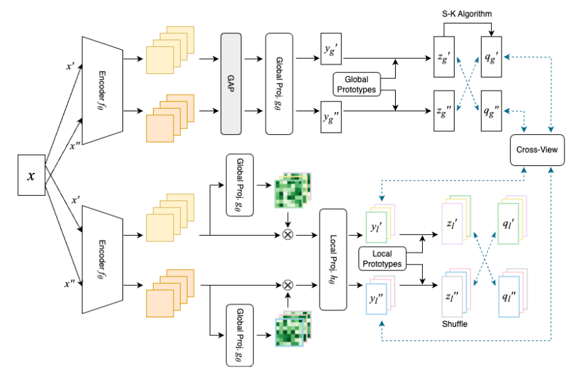

# From Whole to Parts: Integrating Global Context and Local Attention for Self-Supervised Multi-Label Classification

This repo provides a PyTorch implementation and pretrained models for [GOLANG](https://etds.lib.ntnu.edu.tw/thesis/detail/4872aea7b7f5bb72952ea67492c9b340/) 📚

<div align="center">
  
</div>

This research project introduces a self-supervised learning framework tailored for multi-label classification. The framework includes three key ideas to enhance classification performance:

* **Semantic Attention Mechanism:** The model intelligently focuses on regions in images where semantic information is prominent.
* **Global-Local Modules:** Different levels of image information are utilized to improve overall classification performance, capturing both global context and local details.
* **Cross-View Prediction:** We introduce cross-view prediction strategy to learn the relationship between global and local features.

| method | epochs | batch-size | COCO mAP | pretrain dataset | url |
|-------------------|-------------------|---------------------|--------------------|--------------------|--------------------|
| GOLANG | 400 | 128 | 62.4 | COCO 2014 | [model](https://drive.google.com/file/d/19wAtgdgNnuL8On1VW90cov6CcSnBtK-e/view?usp=sharing) |
| GOLANG | 400 | 128 | 65.1 | COCO 2017 | [model](https://drive.google.com/file/d/1YxnzfgIH6ddhBTo3to2rDw3aQx0YNytH/view?usp=sharing) |


## Table of Contents
- [Requirements](#requirements)
- [Usage](#usage)
- [Datasets & Downstream Tasks](#datasets--downstream-tasks)

## Requirements
- Python 3.8
- PyTorch 1.14.0
- torchvision 0.15.0
- CUDA 12.0
- Apex 0.1
- scipy, pandas, numpy

## Usage

To train the model on a single node with 2 gpus for 400 epochs:
```bash
python -m torch.distributed.launch --nproc_per_node=2 main.py \
--data_path /path/to/coco/tmp_root \
--epochs 400 \
--base_lr 0.6 \
--final_lr 0.0006 \
--warmup_epochs 0 \
--batch_size 64 \
--size_crops 224 96 \
--nmb_crops 2 6 \
--min_scale_crops 0.14 0.05 \
--max_scale_crops 1. 0.14 \
--use_fp16 true \
--freeze_prototypes_niters 5005 \
--queue_length 3840 \
--local_queue_length 0 \
--nmb_groups_heads 4 \
--epoch_queue_starts 7
```

## Datasets & Downstream Tasks

Thanks to the SSPRL research team for generously sharing their code for preparing datasets and doing evaluation. We encourage all users interested in replicating or building upon our research to visit the SSPRL research team's repository and follow their comprehensive guidelines. 👏

* 🚀 [SSPRL](https://github.com/WesleyHsieh0806/SS-PRL) 


## Acknowledgements
We would like to express our heartfelt gratitude to the Facebook AI Research team for their outstanding contributions to the field of self-supervised learning. Their groundbreaking work [SwAV](https://github.com/facebookresearch/swav)

Additionally, we extend our appreciation to Hsieh et al. for their exceptional work on [SSPRL](https://github.com/WesleyHsieh0806/SS-PRL)
